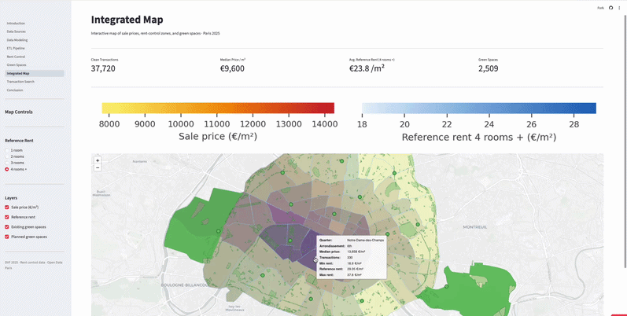
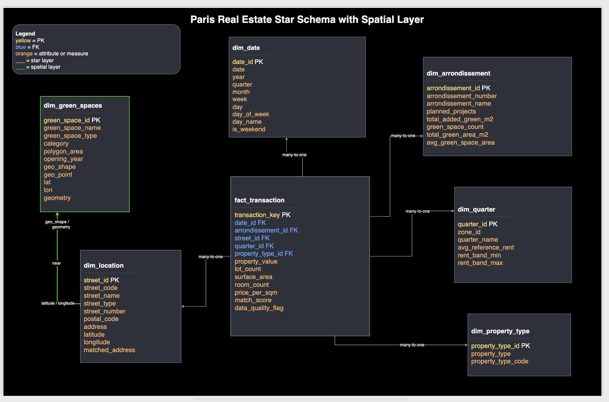
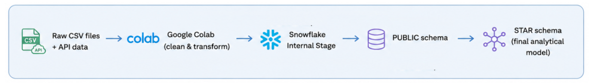

# Paris Real Estate Analytics Engineering Project

Analytics Engineering project analysing property values, rent control zones, and urban green spaces in Paris — from raw public data through to an interactive dashboard.

**Live dashboard:** https://paris-real-estate-ae.streamlit.app/

**Team:** Andrés Lill, Stefania Licciardi, Victoria Ford
Developed as part of the Liora Analytics Engineering Programme (in cooperation with the Université Paris 1 Panthéon-Sorbonne).

---

## Contents

- [Project Overview](#project-overview)
- [Key Insights](#key-insights)
- [Dashboard Preview](#dashboard-preview)
- [Tech Stack](#tech-stack)
- [Data Sources](#data-sources)
- [Getting Started](#getting-started)
- [Data Pipeline (Notebooks)](#data-pipeline-notebooks)
- [Building the Data Warehouse](#building-the-data-warehouse)
- [Dashboard Pages](#dashboard-pages)
- [Folder Structure](#folder-structure)
- [License](#license)

---

## Project Overview

This project integrates four public datasets from the French government and the City of Paris into a unified analytics pipeline, ending in an interactive Streamlit dashboard.

The datasets cover property transactions (DVF 2025), rent control thresholds (encadrement des loyers), existing green spaces, and planned urban greening projects across Paris's 20 arrondissements.

**Pipeline at a glance:** `notebooks/` (extract & transform) → `data/` (clean CSVs) → `sql/` (load & star-schema modeling in Snowflake) → Streamlit dashboard.

---

## Key Insights

- Central Paris districts combine the highest property prices with elevated rent control thresholds.
- High-value areas tend to show lower transaction volumes, suggesting stronger ownership retention.
- Urban green space availability does not necessarily correlate with premium property prices.

---

## Dashboard Preview

### Home Page

Project introduction and business context for the Paris real estate analytics study.


### Analysis Dashboard

Interactive geospatial dashboard combining property transactions, rent control zones, and urban green spaces across Paris.



### Data Modeling

Star schema design and analytical data modeling used to structure the Paris real estate datasets in Snowflake.



### ETL Pipeline

Overview of the end-to-end analytics engineering workflow from raw datasets to the final analytical model in Snowflake.



---

## Tech Stack

**Data Warehouse & Modeling:** Snowflake, SQL, dimensional modeling (3NF → star schema)
**Data Engineering:** ELT pipeline (staging → raw tables → star schema)
**Analysis & Visualization:** Python (Pandas, GeoPandas), geospatial analysis (Folium)
**Dashboard:** Streamlit

---

## Data Sources

| Dataset | Source | Rows |
|---|---|---|
| DVF Transactions 2025 | data.gouv.fr | 38,551 |
| Rent Control 2025 | opendata.paris.fr | 320 |
| Existing Green Spaces | opendata.paris.fr | 2,509 |
| Planned Green Spaces | opendata.paris.fr | 71 |

---

## Getting Started

### Prerequisites

- Python 3.10+

### 1. Clone the repository

```bash
git clone https://github.com/andreslill/paris-real-estate-ae.git
cd paris-real-estate-ae
```

### 2. Create a virtual environment and install dependencies

```bash
python -m venv .venv
source .venv/bin/activate      # Windows: .venv\Scripts\activate
pip install -r requirements.txt
```

### 3. Run the dashboard

```bash
streamlit run Introduction.py
```

The app opens at `http://localhost:8501` and reads the prepared CSVs in `data/`, so it runs without a Snowflake connection.

To rebuild the datasets or the warehouse from scratch, see [Data Pipeline (Notebooks)](#data-pipeline-notebooks) and [Building the Data Warehouse](#building-the-data-warehouse).

---

## Data Pipeline (Notebooks)

The `notebooks/` folder contains the extract-and-transform stage that produces the CSVs in `data/`. Run them in order — each reads from and writes to `../data/`:

| # | Notebook | Purpose | Output |
|---|---|---|---|
| 01 | `fetch_rent_control` | Fetch rent-control thresholds (Paris Open Data API) | `api_rent_control_2025.csv` |
| 02 | `fetch_green_spaces` | Fetch existing green spaces | `green_spaces.csv` |
| 03 | `fetch_planned_green_spaces` | Fetch planned greening projects | `planned_green_spaces.csv` |
| 04 | `load_and_clean_dvf` | Download & clean DVF property transactions | `dvf_paris_2024_2025.csv` |
| 05 | `fetch_coordinates` | Geocode addresses (Base Adresse Nationale API) | `coordinate_matched_addresses.csv` |
| 06 | `merge_coordinates` | Merge coordinates into the DVF dataset | `dvf_paris_2024_2025_with_coordinates.csv` |
| 07 | `dvf_one_row_per_transaction` | Aggregate to one row per transaction | `dvf_paris_2025_aggregated.csv` |
| 08 | `create_dim_date` | Build the date dimension for the star schema | `dim_date.csv` |

The DVF source file is downloaded in notebook 04 (originally published on data.gouv.fr). Joining and modeling of these sources happens in Snowflake — see [Building the Data Warehouse](#building-the-data-warehouse).

---

## Building the Data Warehouse

Once the CSVs are in `data/`, the Snowflake pipeline loads and models them. Run the SQL scripts in order:

**Stage 1 — load raw data** (`sql/load_tables/`)

1. `01_create_stage.sql` – create the internal stage
2. `02_define_file_types.sql` – define the CSV file format
3. `03_create_tables.sql` – create the raw tables
4. `04_populate_tables.sql` – load the CSVs into the raw tables

**Stage 2 — build the star schema** (`sql/star_schema/`)

1. `01_create_star_schema.sql` – create dimension and fact tables
2. `02_check_tables.sql` – validate the loaded tables
3. `03_populate_star_schema.sql` – populate the star schema
4. `04_analysis_queries.sql` – example analytical queries

Snowflake connection settings (for running the pipeline against your own account) live in `.streamlit/secrets.toml`, which is git-ignored:

```toml
[connections.snowflake]
account   = "your_account"
user      = "your_user"
password  = "your_password"
role      = "your_role"
warehouse = "your_warehouse"
database  = "PARIS_REAL_ESTATE"
schema    = "PUBLIC"
```

---

## Dashboard Pages

- **Home** – Project context, research questions, and KPIs
- **Data Sources** – Dataset overview and limitations
- **Data Modeling** – 3NF to star schema design
- **ETL Pipeline** – Data ingestion and Snowflake loading
- **Rent Control** – Rent-control thresholds (encadrement des loyers) by quartier
- **Green Spaces** – Existing and planned urban green spaces
- **Integrated Map** – Interactive geospatial dashboard combining property prices, rent control, and green spaces
- **Transaction Search** – Searchable view of individual property transactions
- **Conclusion** – Summary of findings and takeaways

---

## Folder Structure

```txt
paris-real-estate-ae/
├── assets/
│   ├── screenshots/
│   ├── paris.jpg
│   ├── map.png
│   ├── pipeline_overview.png
│   ├── implementation_summary.png
│   └── star_schema.png
│
├── data/
│   ├── dvf_paris_2025_aggregated.csv
│   ├── api_rent_control_2025.csv
│   ├── green_spaces.csv
│   └── planned_green_spaces.csv
│
├── notebooks/
│   ├── 01_fetch_rent_control.ipynb
│   ├── 02_fetch_green_spaces.ipynb
│   ├── 03_fetch_planned_green_spaces.ipynb
│   ├── 04_load_and_clean_dvf.ipynb
│   ├── 05_fetch_coordinates.ipynb
│   ├── 06_merge_coordinates.ipynb
│   ├── 07_dvf_one_row_per_transaction.ipynb
│   └── 08_create_dim_date.ipynb
│
├── pages/
│   ├── 1_Data_Sources.py
│   ├── 2_Data_Modeling.py
│   ├── 3_ETL_Pipeline.py
│   ├── 4_Rent_Control.py
│   ├── 5_Green_Spaces.py
│   ├── 6_Integrated_Map.py
│   ├── 7_Transaction_Search.py
│   └── 8_Conclusion.py
│
├── sql/
│   ├── load_tables/
│   │   ├── 01_create_stage.sql
│   │   ├── 02_define_file_types.sql
│   │   ├── 03_create_tables.sql
│   │   └── 04_populate_tables.sql
│   │
│   └── star_schema/
│       ├── 01_create_star_schema.sql
│       ├── 02_check_tables.sql
│       ├── 03_populate_star_schema.sql
│       └── 04_analysis_queries.sql
│
├── visualizations/
│   └── green_context.py
│
├── Introduction.py
├── data_loader.py
├── README.md
├── requirements.txt
├── LICENSE
├── .gitignore
└── .gitattributes
```

---

